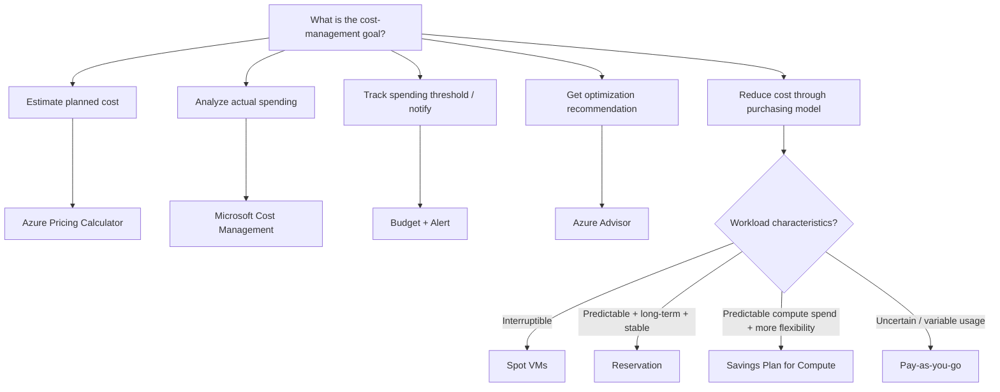

# Cost Management Decision Tree

Start with the **goal**, not a product name or a trigger word.



## High-Value Distinctions

```text
PLANNED cost
→ Pricing Calculator

ACTUAL spending
→ Microsoft Cost Management

THRESHOLD notification
→ Budget + Alert

OPTIMIZATION recommendation
→ Azure Advisor
```

## Optimization Decision

When the question is about reducing compute cost, identify the workload constraints before choosing the discount model.

```text
Can tolerate interruption
→ Spot

Predictable long-term stable usage
→ Reservation

Predictable compute spend + greater flexibility
→ Savings Plan

Uncertain / variable usage
→ Pay-as-you-go
```

## Common Cost Traps

### Budget Is Not a Hard Limit

```text
Budget reached
→ alert / visibility
→ resources do NOT automatically stop
```

### Cheapest Is Not Automatically Best

A lower-cost option is incorrect if it violates a workload requirement, such as choosing Spot for a workload that cannot tolerate interruption.

### Cost Management vs Advisor

```text
What are we spending?
→ Cost Management

What should we improve?
→ Advisor
```

## Final Decision Rule

```text
1. Identify the goal.
2. Identify whether the cost is planned or actual.
3. If optimizing, identify workload constraints.
4. Choose the option that satisfies all requirements without unnecessary commitment or risk.
```
