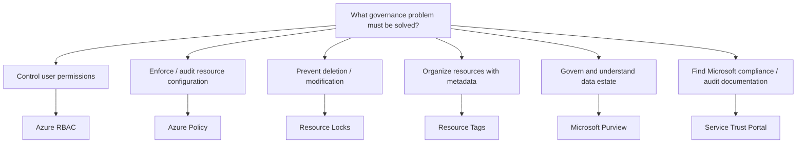

# Governance Decision Tree

Start with the **problem**, not a trigger word.



## High-Value Distinctions

```text
WHO can perform actions?
→ Azure RBAC

WHAT configuration is allowed or required?
→ Azure Policy

Prevent DELETE only?
→ CanNotDelete lock

Prevent MODIFY + DELETE?
→ ReadOnly lock

LABEL / ORGANIZE resources?
→ Resource Tags

GOVERN DATA across environments?
→ Microsoft Purview

MICROSOFT COMPLIANCE / AUDIT DOCUMENTS?
→ Service Trust Portal
```

## Scope and Inheritance Traps

```text
RBAC at parent scope
→ permissions can apply below

Policy at parent scope
→ governance rules can apply below

Lock at parent scope
→ child resources inherit the lock

Tag at parent scope
→ NOT automatically inherited by child resources
```

## Administrative Actions Trap

Do not choose RBAC merely because a question mentions an administrator.

```text
Control whether the administrator is AUTHORIZED?
→ RBAC

Protect an existing resource even from an authorized delete/update operation?
→ Resource Locks
```

## Final Decision Rule

```text
1. What is being controlled?
2. Is it permissions, configuration, protection, metadata, data governance, or documentation?
3. Choose the service that directly solves that problem.
```
