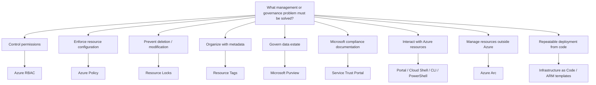

# Governance and Management Decision Tree

Start with the **problem**, not a trigger word.



## High-Value Distinctions

```text
WHO can perform actions?
→ Azure RBAC

WHAT configuration is allowed or required?
→ Azure Policy

Prevent DELETE / MODIFY?
→ Resource Locks

LABEL / ORGANIZE resources?
→ Resource Tags

GOVERN DATA?
→ Microsoft Purview

MICROSOFT COMPLIANCE DOCUMENTS?
→ Service Trust Portal

GUI management?
→ Azure Portal

Browser-hosted shell?
→ Azure Cloud Shell

Cross-platform command line?
→ Azure CLI

PowerShell administration?
→ Azure PowerShell

MANAGE non-Azure / on-prem resources through Azure?
→ Azure Arc

REPEATABLE infrastructure defined in code?
→ IaC / ARM templates
```
