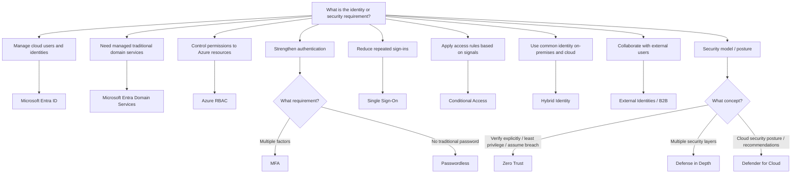

# Identity Decision Tree



## High-Value Distinctions

```text
CLOUD IDENTITY
→ Microsoft Entra ID

MANAGED LDAP / KERBEROS / DOMAIN JOIN
→ Microsoft Entra Domain Services

WHAT CAN YOU DO TO AZURE RESOURCES?
→ Azure RBAC

MORE AUTHENTICATION FACTORS?
→ MFA

NO TRADITIONAL PASSWORD?
→ Passwordless

ONE SIGN-IN FOR MANY APPS?
→ SSO

SIGNALS / CONDITIONS → ACCESS DECISION?
→ Conditional Access

EXTERNAL PARTNER?
→ External Identities / B2B
```
