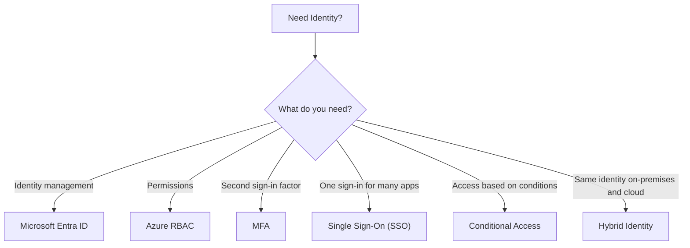

# Identity Decision Tree

```mermaid
flowchart TD

    A["Need Identity?"] --> B{"What do you need?"}

    B -->|Identity management| C["Microsoft Entra ID"]

    B -->|Permissions| D["Azure RBAC"]

    B -->|Second sign-in factor| E["MFA"]

    B -->|One sign-in for many apps| F["Single Sign-On (SSO)"]

    B -->|Access based on conditions| G["Conditional Access"]

    B -->|Same identity on-premises and cloud| H["Hybrid Identity"]
```