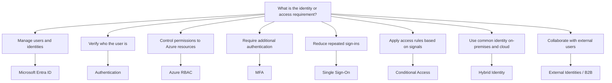

# Identity Decision Tree



## High-Value Distinctions

```text
WHO ARE YOU?
→ Authentication

WHAT CAN YOU DO TO AZURE RESOURCES?
→ Authorization / Azure RBAC

MORE AUTHENTICATION FACTORS?
→ MFA

ONE SIGN-IN FOR MANY APPS?
→ SSO

IF location/device/risk THEN allow/block/require MFA?
→ Conditional Access

SAME IDENTITY ON-PREMISES + CLOUD?
→ Hybrid Identity

EXTERNAL PARTNER / VENDOR / SUPPLIER?
→ External Identities / B2B
```

## Best-Fit Examples

| Scenario | Best fit |
|---|---|
| Manage cloud users and groups | Microsoft Entra ID |
| Give a user read-only access to an Azure resource | Azure RBAC — Reader |
| Require additional authentication factors | MFA |
| Require MFA only from an untrusted location | Conditional Access |
| Sign in once and access multiple applications | SSO |
| Integrate on-premises Active Directory identities with cloud identity | Hybrid Identity |
| Allow a business partner to collaborate using an external identity | External Identities / B2B |
