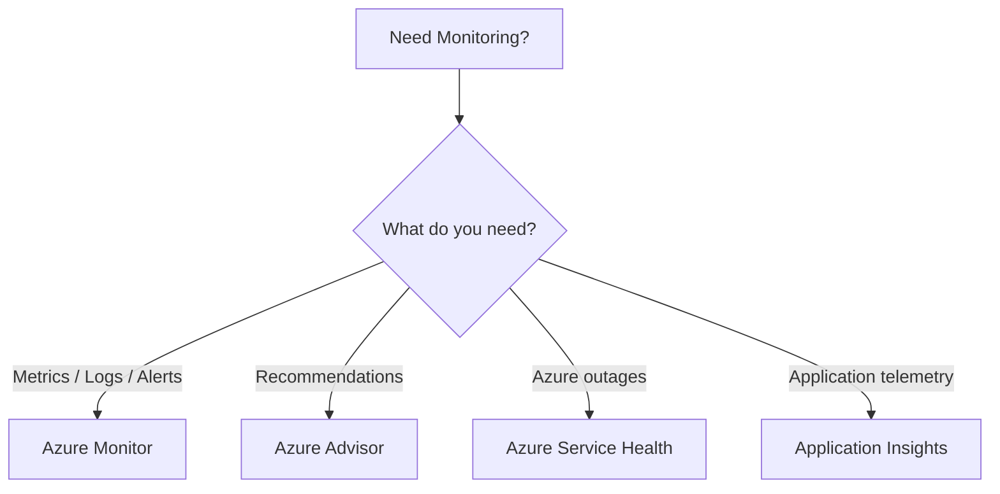

# Monitoring Decision Tree

```mermaid
flowchart TD

    A["Need Monitoring?"] --> B{"What do you need?"}

    B -->|Metrics / Logs / Alerts| C["Azure Monitor"]

    B -->|Recommendations| D["Azure Advisor"]

    B -->|Azure outages| E["Azure Service Health"]

    B -->|Application telemetry| F["Application Insights"]
```