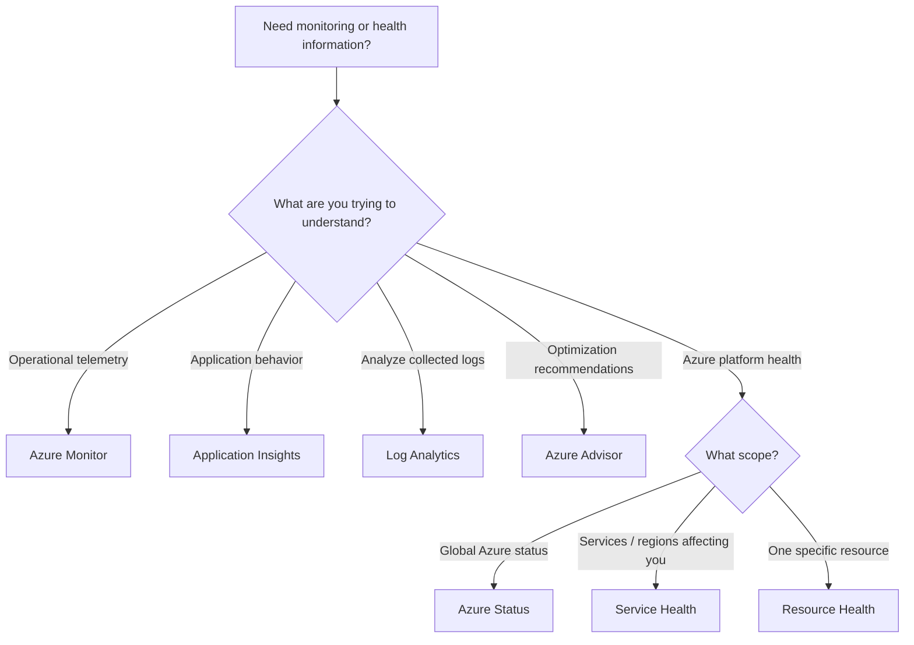

# Monitoring Decision Tree



## Quick Decision Guide

```text
WHAT IS HAPPENING WITH MY WORKLOAD?
→ Azure Monitor

WHAT IS HAPPENING INSIDE MY APPLICATION?
→ Application Insights

WHAT DO THE COLLECTED LOGS SAY?
→ Log Analytics

WHAT SHOULD I IMPROVE?
→ Azure Advisor

IS AZURE HAVING A PLATFORM PROBLEM THAT AFFECTS ME?
→ Service Health

IS THIS ONE RESOURCE HEALTHY?
→ Resource Health

WHAT IS THE BROAD GLOBAL STATUS OF AZURE?
→ Azure Status
```

## Scenario Examples

| Scenario | Best Fit |
|---|---|
| VM CPU exceeds 80% | **Azure Monitor** |
| Query historical logs | **Log Analytics** |
| Web application has failed requests | **Application Insights** |
| Find underutilized resources | **Azure Advisor** |
| Planned Azure maintenance affecting your region | **Service Health** |
| Check health of one specific VM | **Resource Health** |
| Check broad Azure service availability | **Azure Status** |
