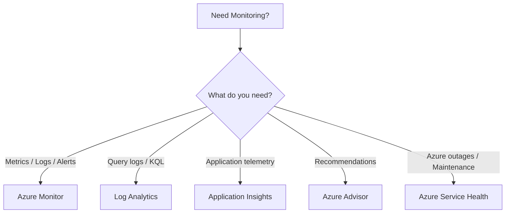

# Monitoring Decision Tree

```mermaid
flowchart TD

    A["Need Monitoring?"] --> B{"What do you need?"}

    B -->|Metrics / Logs / Alerts| C["Azure Monitor"]

    B -->|Query logs / KQL| D["Log Analytics"]

    B -->|Application telemetry| E["Application Insights"]

    B -->|Recommendations| F["Azure Advisor"]

    B -->|Azure outages / Maintenance| G["Azure Service Health"]
```