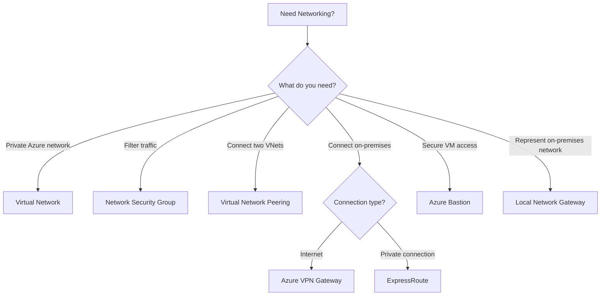

# Networking Decision Tree

```mermaid
flowchart TD

    A["Need Networking?"] --> B{"What do you need?"}

    B -->|Private Azure network| C["Virtual Network"]

    B -->|Filter traffic| D["Network Security Group"]

    B -->|Connect two VNets| E["Virtual Network Peering"]

    B -->|Connect on-premises| F{"Connection type?"}

    F -->|Internet| G["Azure VPN Gateway"]

    F -->|Private connection| H["ExpressRoute"]

    B -->|Secure VM access| I["Azure Bastion"]

    B -->|Represent on-premises network| J["Local Network Gateway"]
```