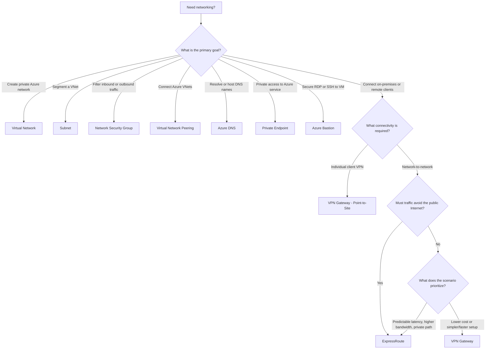

# Networking Decision Tree

```mermaid
flowchart TD
    A["Need networking?"] --> B{"What is the primary goal?"}

    B -->|Create private Azure network| VNET["Virtual Network"]
    B -->|Segment a VNet| SUBNET["Subnet"]
    B -->|Filter inbound or outbound traffic| NSG["Network Security Group"]
    B -->|Connect Azure VNets| PEER["Virtual Network Peering"]
    B -->|Resolve or host DNS names| DNS["Azure DNS"]
    B -->|Private access to Azure service| PE["Private Endpoint"]
    B -->|Secure RDP or SSH to VM| BASTION["Azure Bastion"]
    B -->|Connect on-premises or remote clients| HYBRID{"What connectivity is required?"}

    HYBRID -->|Individual client VPN| P2S["VPN Gateway - Point-to-Site"]
    HYBRID -->|Network-to-network| PATH{"Must traffic avoid the public Internet?"}

    PATH -->|Yes| ER["ExpressRoute"]
    PATH -->|No| PRIORITY{"What does the scenario prioritize?"}

    PRIORITY -->|Lower cost or simpler/faster setup| VPN["VPN Gateway"]
    PRIORITY -->|Predictable latency, higher bandwidth, private path| ER
```