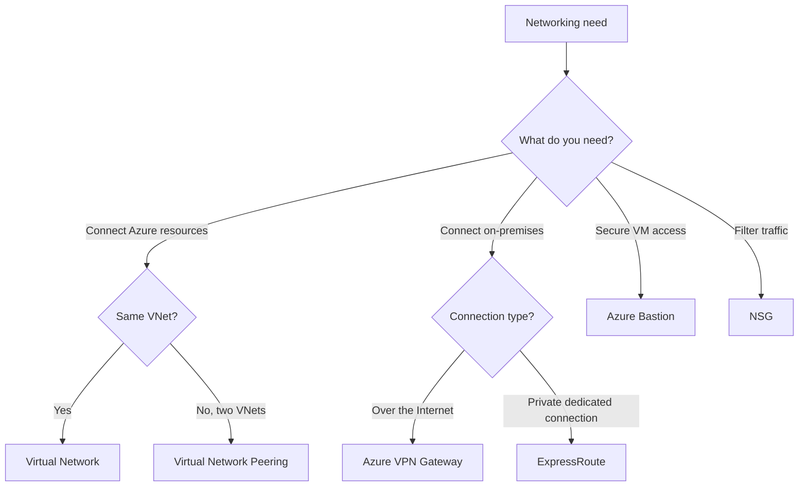

```mermaid
flowchart TD
    A["Networking need"] --> B{"What do you need?"}

    B -->|Connect Azure resources| C{"Same VNet?"}
    C -->|Yes| D["Virtual Network"]
    C -->|No, two VNets| E["Virtual Network Peering"]

    B -->|Connect on-premises| F{"Connection type?"}
    F -->|Over the Internet| G["Azure VPN Gateway"]
    F -->|Private dedicated connection| H["ExpressRoute"]

    B -->|Secure VM access| I["Azure Bastion"]
    B -->|Filter traffic| J["NSG"]
```