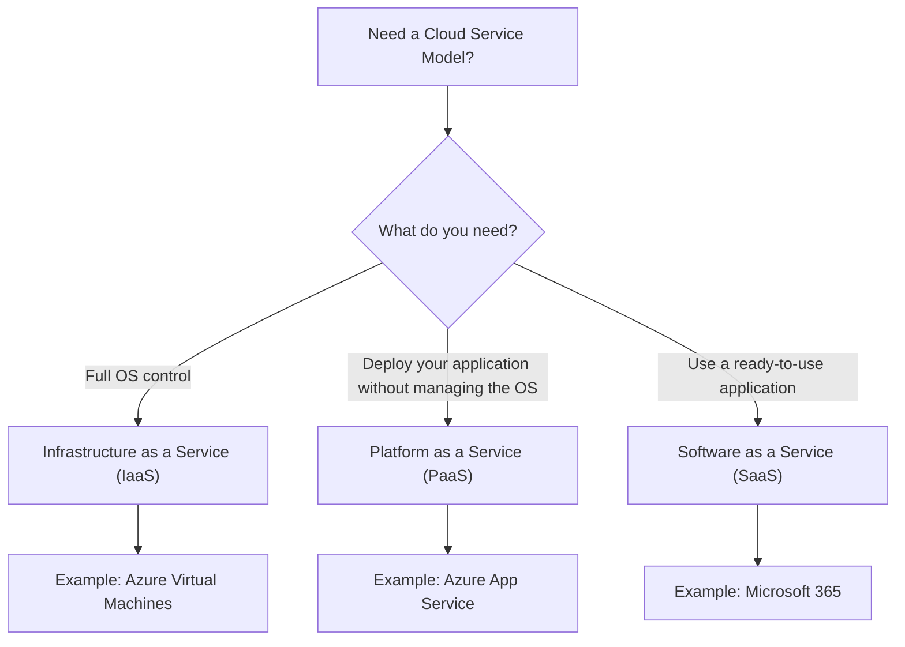

# Service Models Decision Tree

```mermaid
flowchart TD

    A["Need a Cloud Service Model?"] --> B{"What do you need?"}

    B -->|Full OS control| C["Infrastructure as a Service (IaaS)"]

    B -->|Deploy your application without managing the OS| D["Platform as a Service (PaaS)"]

    B -->|Use a ready-to-use application| E["Software as a Service (SaaS)"]

    C --> F["Example: Azure Virtual Machines"]

    D --> G["Example: Azure App Service"]

    E --> H["Example: Microsoft 365"]
```