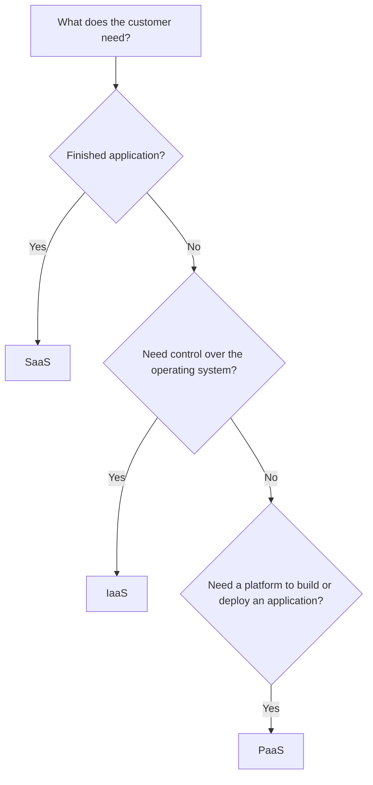

# Service Models Decision Tree

Start with **what the customer needs to manage**, not with a trigger word.



## High-Value Distinctions

```text
CONTROL OS
→ IaaS

BUILD / DEPLOY APPLICATION
without managing OS
→ PaaS

USE FINISHED APPLICATION
→ SaaS
```

## Service Classification

| Example | Model |
|---|---|
| Azure Virtual Machines | **IaaS** |
| Azure App Service | **PaaS** |
| Azure SQL Database | **PaaS** |
| Azure Functions | **PaaS / serverless compute** |
| Microsoft 365 | **SaaS** |

## Responsibility Decision

```text
MORE CUSTOMER RESPONSIBILITY

On-premises
     ↓
IaaS
     ↓
PaaS
     ↓
SaaS

LESS CUSTOMER RESPONSIBILITY
```

High-value OS distinction:

```text
Customer manages OS
→ On-premises / IaaS

Provider manages OS
→ PaaS / SaaS
```

## Common Exam Traps

```text
SaaS
≠ zero customer responsibility
```

The customer still has responsibilities for areas such as data, identities, and access.

```text
PaaS vs SaaS
→ BUILD vs USE

IaaS vs PaaS
→ customer OS control vs provider-managed OS
```

## Final Decision Rule

```text
Need OS control?
→ IaaS

Need to build/deploy without OS management?
→ PaaS

Need finished software?
→ SaaS
```
