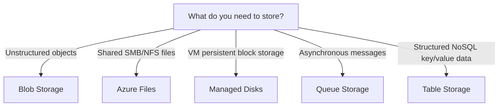
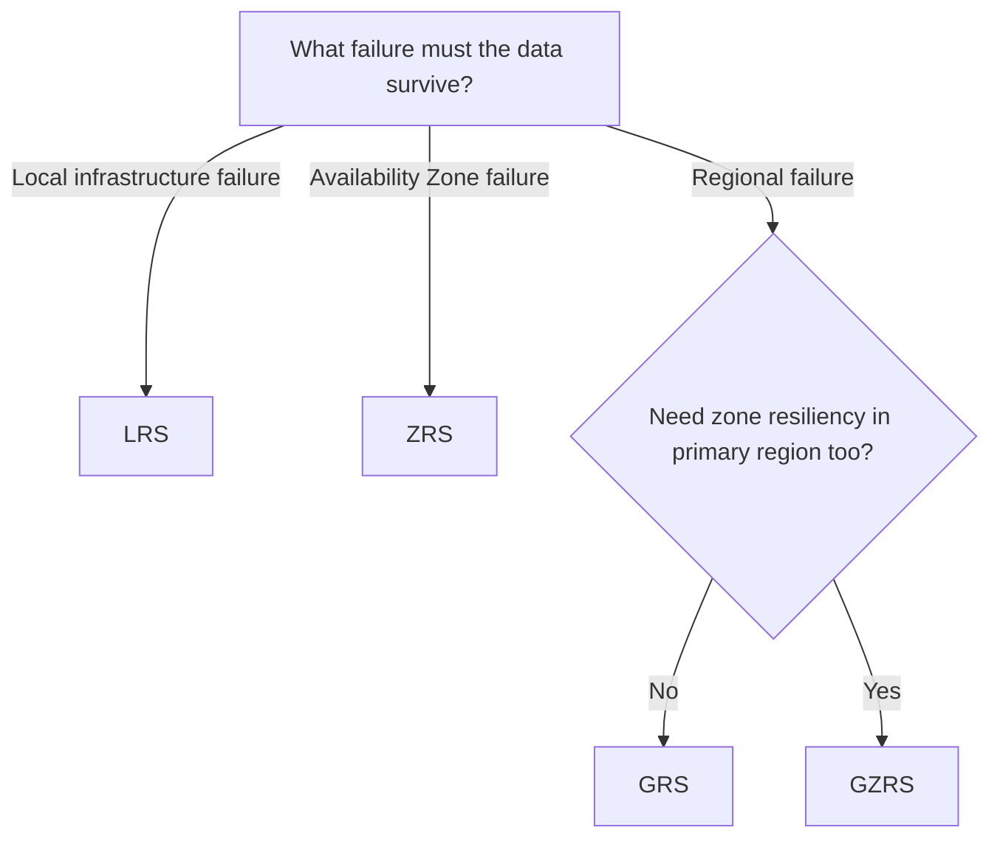
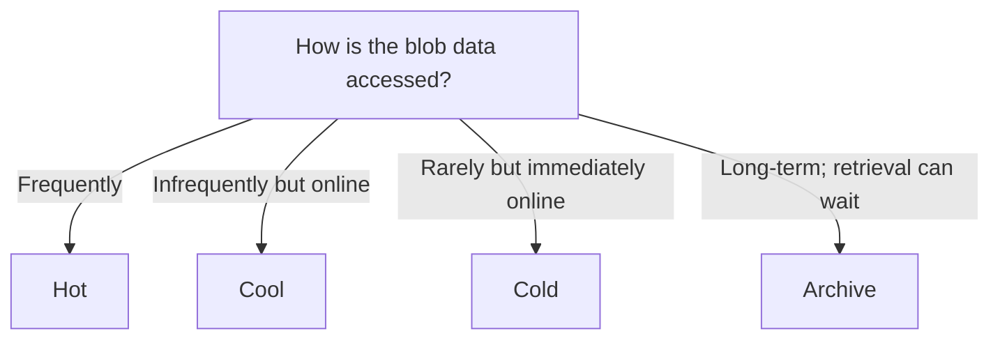
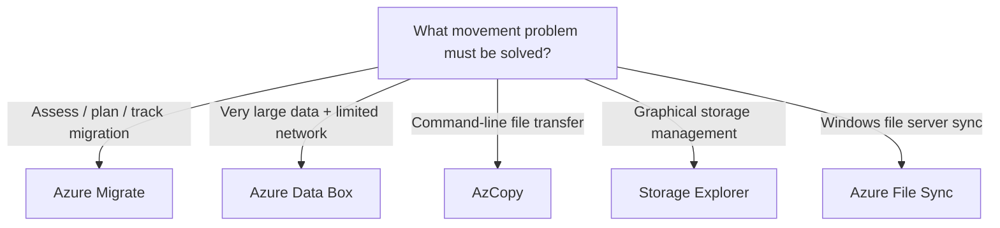

# Storage Decision Tree

Storage questions usually test one of four decisions:

```text
WHAT DATA?
→ Storage service

WHAT FAILURE?
→ Redundancy

HOW OFTEN ACCESSED?
→ Blob access tier

HOW SHOULD IT MOVE?
→ Migration / file movement tool
```

## 1. Choose the Storage Service



## 2. Choose Storage Redundancy



> If multiple options satisfy the requirement, prefer the least complex/costly option that still provides the required resiliency.

## 3. Choose a Blob Access Tier



Remember:

```text
Hot / Cool / Cold
→ online

Archive
→ offline; rehydration required
```

## 4. Choose a Movement or Migration Tool



## High-Value Distinctions

| Scenario | Best Fit |
|---|---|
| Images, videos, backups | Blob Storage |
| Shared SMB/NFS files | Azure Files |
| VM OS/data disk | Managed Disks |
| Messages processed later | Queue Storage |
| Structured NoSQL key/value data | Table Storage |
| Zone failure protection | ZRS |
| Regional failure protection | GRS |
| Zone + regional protection | GZRS |
| Rare data that must remain online | Cold |
| Long-term offline retention | Archive |
| CLI file copy | AzCopy |
| GUI storage management | Storage Explorer |
| Windows file server synchronization | Azure File Sync |
| Migration assessment/planning | Azure Migrate |
| Very large physical transfer | Azure Data Box |
