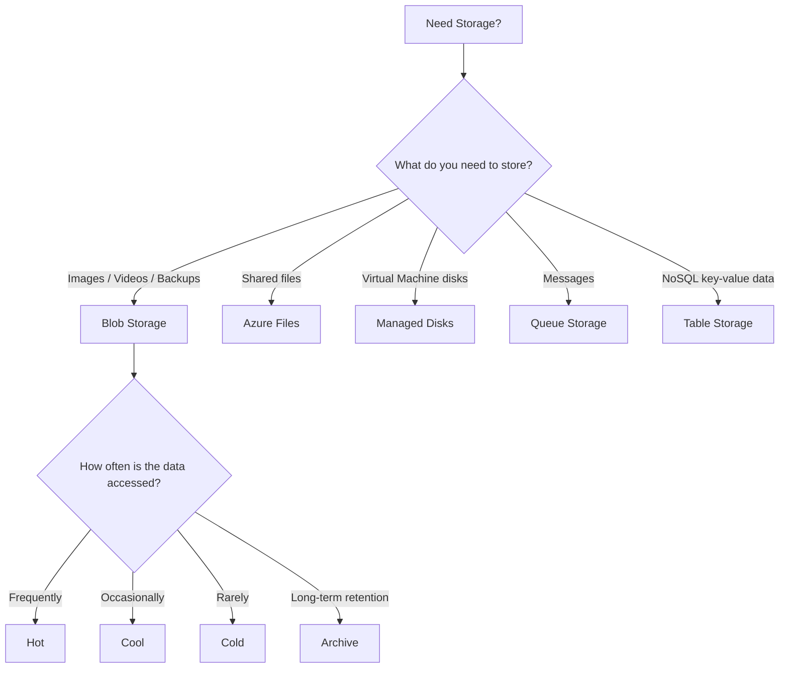

# Storage Decision Tree

```mermaid
flowchart TD

    A["Need Storage?"] --> B{"What do you need to store?"}

    B -->|Images / Videos / Backups| C["Blob Storage"]

    B -->|Shared files| D["Azure Files"]

    B -->|Virtual Machine disks| E["Managed Disks"]

    B -->|Messages| F["Queue Storage"]

    B -->|NoSQL key-value data| G["Table Storage"]

    C --> H{"How often is the data accessed?"}

    H -->|Frequently| I["Hot"]

    H -->|Occasionally| J["Cool"]

    H -->|Rarely| K["Cold"]

    H -->|Long-term retention| L["Archive"]
```