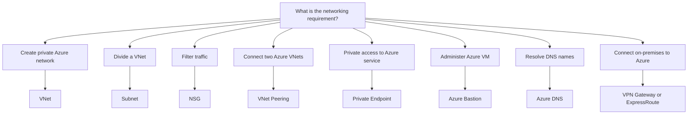
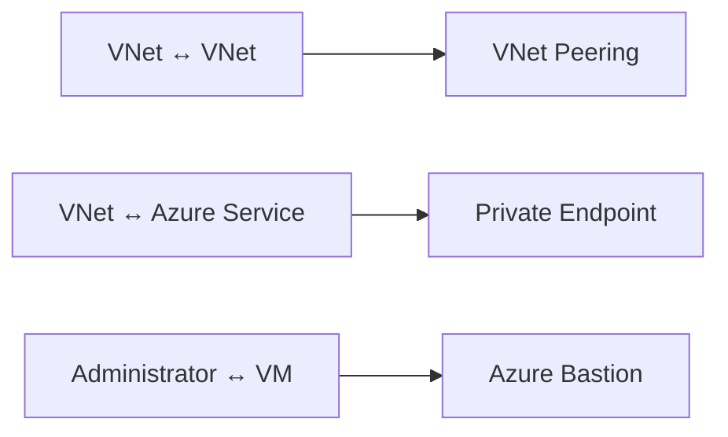
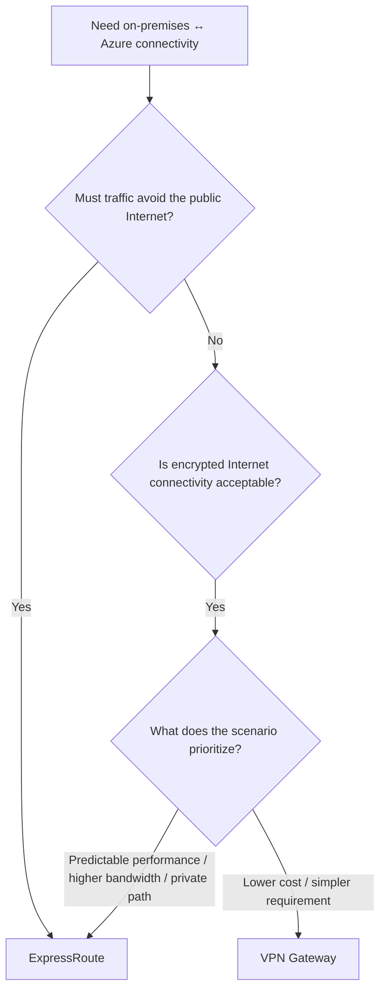
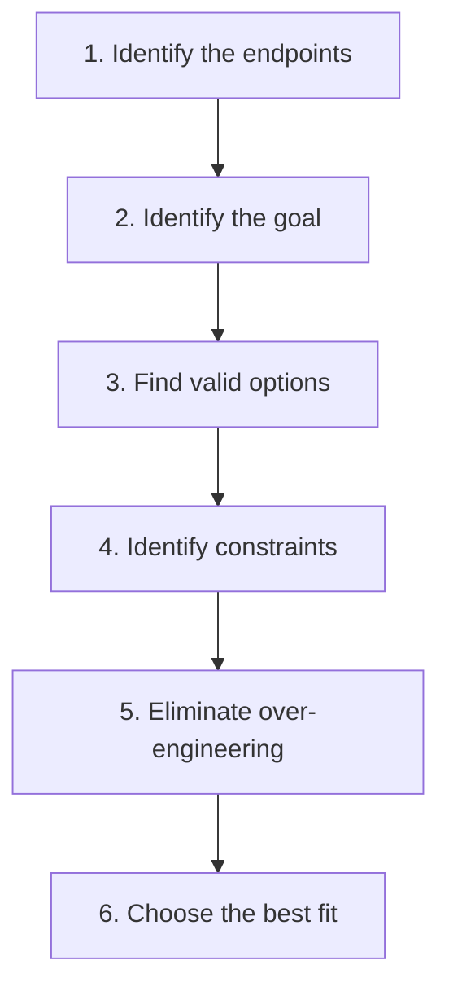

# Networking — Quick Review

Use this page for fast AZ-900 networking review.

The goal is not only to remember what each Azure networking service does, but to identify the **best-fit solution for a scenario**.

> **Review principle:** Do not start with a trigger word.  
> Identify the **endpoints**, then the **goal**, then the **constraints**.

---

## 1. Networking Decision Map

Start with:

> **What are you trying to connect or accomplish?**



For connectivity questions, identify the **two endpoints** first.

The word **private** alone is not enough to determine the answer.

---

## 2. Core Networking Components

### Virtual Network — VNet

Provides a private network environment and address space for Azure resources.

> **Create an Azure private network → VNet**

### Subnet

Divides a VNet address space into smaller network segments.

```text
VNet
├── Web Subnet
├── Application Subnet
└── Database Subnet
```

> **Divide a VNet → Subnet**

A subnet provides segmentation **inside a VNet**. It does not connect separate networks.

### Network Security Group — NSG

Controls inbound and outbound network traffic using allow and deny rules.

Rules can evaluate:

- source and destination
- port
- protocol
- inbound or outbound direction

> **Control traffic → NSG**

**Important:** An NSG controls traffic. It does **not** create network connectivity.

### Public vs Private Endpoint

A **Public Endpoint** provides publicly reachable access.

A **Private Endpoint** provides private access to a supported Azure service using a private IP address from a VNet.

> **Private IP access to Azure service → Private Endpoint**

---

## 3. Private Connectivity Choices

VNet Peering, Private Endpoint, and Azure Bastion can all appear in private-networking scenarios, but they solve different problems.



### VNet Peering

Connects **two Azure Virtual Networks** privately.

> **VNet ↔ VNet → VNet Peering**

### Private Endpoint

Provides private access from a VNet to a supported Azure service through a private IP.

Example:

```text
Application in VNet
        ↓
Private Endpoint
        ↓
Azure Storage
```

> **VNet ↔ Azure Service → Private Endpoint**

### Azure Bastion

Provides secure administrative access to Azure VMs using RDP or SSH without requiring a public IP on the target VM.

> **Administrator ↔ VM → Azure Bastion**

### Key Distinction

Do not ask:

> Does the scenario say **private**?

Ask:

> **Private connection between WHAT?**

---

## 4. VPN Gateway vs ExpressRoute

Both can provide connectivity between an on-premises environment and Azure.

The correct choice depends on the **technical and business requirements**.

| Decision Factor | VPN Gateway | ExpressRoute |
|---|---|---|
| Connection | Encrypted VPN | Private connection |
| Public Internet | Used as transport | Does not traverse public Internet |
| Typical cost | Lower | Higher |
| Setup | Generally simpler | More involved |
| Performance | Internet-dependent | More predictable |
| Bandwidth | Lower options | Higher options available |

### Decision Process



### VPN Gateway

Best fit when:

- encrypted Internet connectivity is acceptable
- lower cost is important
- connectivity requirements are simpler

> **Encrypted Internet connectivity is sufficient → VPN Gateway**

### ExpressRoute

Best fit when the scenario requires or prioritizes:

- private connectivity
- traffic that does not traverse the public Internet
- more predictable network performance
- higher bandwidth

> **Private connectivity is required → ExpressRoute**

### Exam Rule

If multiple solutions technically work, look for what the scenario is optimizing:

```text
Cost
Administrative effort
Security
Performance
Latency
Bandwidth
Public vs private connectivity
```

> Choose the solution that satisfies **all requirements without unnecessary capabilities**.

---

## 5. Azure DNS

Azure DNS provides DNS hosting and name resolution using Azure infrastructure.

```text
Domain Name
     ↓
 Azure DNS
     ↓
 IP Address
```

> **Name resolution → Azure DNS**

Azure DNS does not:

- connect VNets
- create VPN tunnels
- provide RDP/SSH access
- filter network traffic

---

## 6. How to Solve Networking Scenario Questions

Use this process instead of searching for a trigger word.



### Step 1 — Identify the Endpoints

Ask:

> **What is communicating with what?**

Examples:

```text
VNet ↔ VNet
VNet ↔ Azure Service
Administrator ↔ VM
On-premises ↔ Azure
```

### Step 2 — Identify the Goal

What must happen?

```text
CONNECT
FILTER
SEGMENT
RESOLVE
ADMINISTER
PRIVATE ACCESS
```

### Step 3 — Find Valid Options

Ask:

> **Could more than one answer technically satisfy the basic requirement?**

This is especially important for **VPN Gateway vs ExpressRoute**.

### Step 4 — Identify the Constraints

Look for:

- cost
- administrative effort
- security
- performance
- latency
- bandwidth
- public vs private connectivity

### Step 5 — Eliminate Over-Engineering

Ask:

> **Does one solution provide capabilities the scenario never requested?**

For example:

```text
Encrypted Internet connectivity is acceptable
+
lower cost is important
        ↓
VPN Gateway
```

Do not choose ExpressRoute simply because it provides more advanced connectivity characteristics.

### Step 6 — Choose the Best Fit

```text
Technical requirement
        +
Business constraints
        +
No unnecessary capabilities
        ↓
BEST FIT
```

---

## 7. Common Networking Traps

### Private Does Not Automatically Mean Private Endpoint

Identify what is being connected:

```text
VNet ↔ VNet
→ VNet Peering

VNet ↔ Azure Service
→ Private Endpoint

Administrator ↔ VM
→ Azure Bastion
```

### Subnet vs NSG

```text
Divide network
→ Subnet

Control traffic
→ NSG
```

A subnet provides segmentation. An NSG provides traffic filtering.

### NSG Does Not Create Connectivity

```text
Allow / Deny
Inbound / Outbound
Port / Protocol
→ NSG
```

NSG controls traffic that already has a network path.

### On-Premises ↔ Azure Does Not Automatically Mean ExpressRoute

Both VPN Gateway and ExpressRoute may satisfy the basic connectivity requirement.

Ask:

```text
Must traffic avoid the public Internet?
Is encrypted Internet connectivity sufficient?
What matters most: cost, administration, performance, or bandwidth?
```

### Azure DNS Does Not Create Connectivity

```text
Name → IP
→ Azure DNS
```

DNS provides name resolution, not network connectivity.

---

## 30-Second Review

```text
Create Azure private network
→ VNet

Divide VNet
→ Subnet

Filter traffic
→ NSG

VNet ↔ VNet
→ VNet Peering

VNet ↔ Azure Service
→ Private Endpoint

Administrator ↔ VM
→ Azure Bastion

Name resolution
→ Azure DNS

Encrypted Internet connectivity
→ VPN Gateway

Private on-premises connectivity
→ ExpressRoute
```

### Final Networking Rule

```text
ENDPOINTS
    ↓
GOAL
    ↓
VALID OPTIONS
    ↓
CONSTRAINTS
    ↓
REMOVE OVER-ENGINEERING
    ↓
BEST FIT
```

> **Endpoint + Goal + Constraints → Best Fit**