# Networking — Quick Review

This page is designed for a fast review of the most important Azure networking concepts and decision patterns.

The goal is not only to remember what each service does, but to identify the **best-fit solution for a given scenario**.

> **Review principle:** Do not start with a trigger word.  
> First identify **what is communicating with what**, then determine the requirement and the business constraints.

---

## 1. Start With the Two Endpoints

When a networking question looks confusing, first ask:

> **What are the two things that need to communicate?**

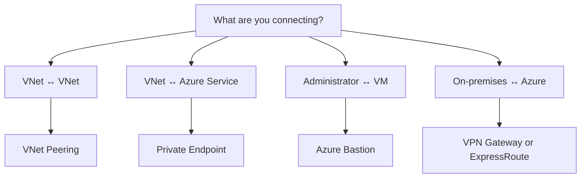

### Remember

Always identify the **two endpoints** before choosing the networking service.

The word **private** alone is not enough to determine the answer.

---

## 2. Core Networking Components

### Virtual Network — VNet

An Azure Virtual Network provides a private network environment for Azure resources.

Think:

> **Create an Azure private network → VNet**

A VNet provides the network address space in which Azure resources can communicate.

---

### Subnet

A subnet divides a VNet address space into smaller network segments.

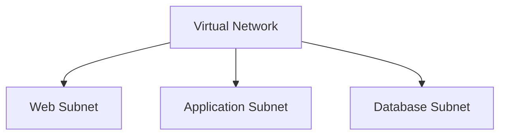

Think:

> **Divide a VNet → Subnet**

A subnet does not connect separate networks.

It organizes and segments the address space **inside a VNet**.

---

### Network Security Group — NSG

A Network Security Group controls inbound and outbound network traffic by using security rules.

Think:

> **Control traffic → NSG**

An NSG can evaluate characteristics such as:

- source
- destination
- port
- protocol
- inbound or outbound direction

and then:

- allow traffic
- deny traffic

> **Important:** An NSG controls traffic.  
> It does **not** create connectivity between networks.

---

## 3. VNet Peering vs Private Endpoint vs Bastion

These services solve completely different problems even though all of them may appear in private-networking scenarios.

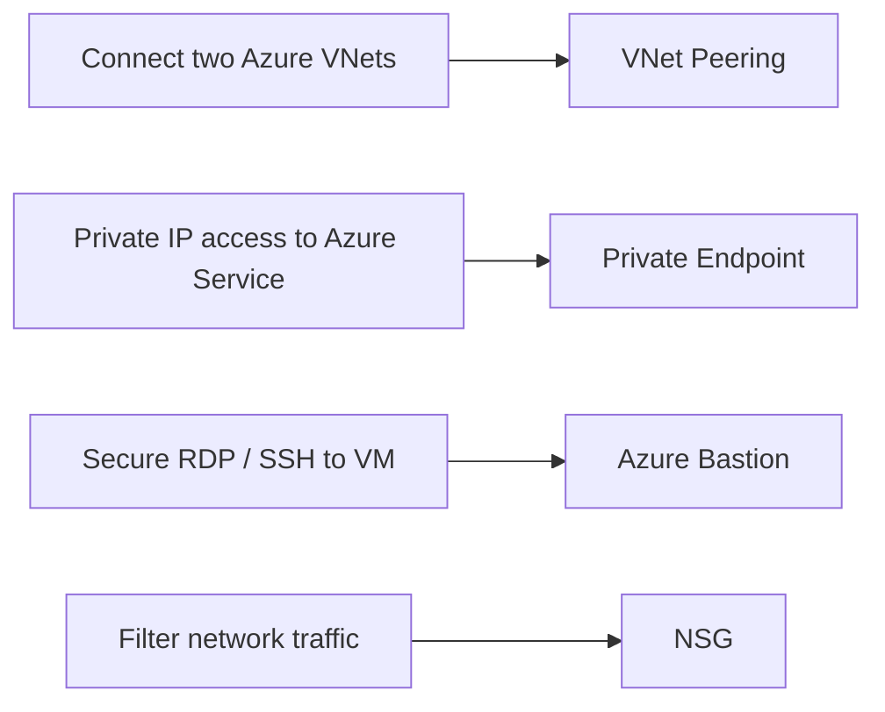

### VNet Peering

Use VNet Peering when **two Azure Virtual Networks** need private connectivity.

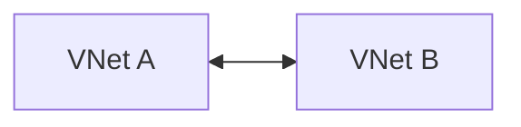

Think:

> **VNet ↔ VNet → VNet Peering**

---

### Private Endpoint

Use a Private Endpoint when resources inside a VNet need private access to a supported Azure service by using a **private IP address**.

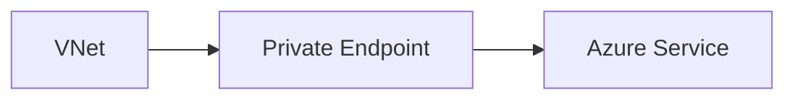

Example:

```text
Application in VNet
        ↓
Private IP
        ↓
Private Endpoint
        ↓
Azure Storage
```

Think:

> **VNet ↔ Azure Service → Private Endpoint**

---

### Azure Bastion

Azure Bastion provides secure administrative access to Azure Virtual Machines.

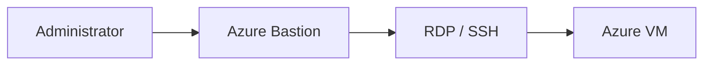

It allows VM administration without requiring a public IP address on the target VM.

Think:

> **Administrator ↔ VM → Azure Bastion**

---

### The Important Distinction

Do not choose a service just because the scenario contains the word **private**.

Ask:

> **Private connection between WHAT?**

```text
VNet ↔ VNet
→ VNet Peering

VNet ↔ Azure Service
→ Private Endpoint

Administrator ↔ VM
→ Azure Bastion
```

---

## 4. VPN Gateway vs ExpressRoute

Both Azure VPN Gateway and Azure ExpressRoute can provide connectivity between an on-premises environment and Azure.

The correct answer depends on the **business and technical requirements**.

| Decision Factor | VPN Gateway | ExpressRoute |
|---|---|---|
| Connection | Encrypted VPN | Private connection |
| Public Internet | Used as transport | Does not traverse the public Internet |
| Typical cost | Lower | Higher |
| Setup | Generally simpler | More involved |
| Performance | Internet-dependent | More predictable |
| Bandwidth | Lower options | Higher options available |

### Decision Map

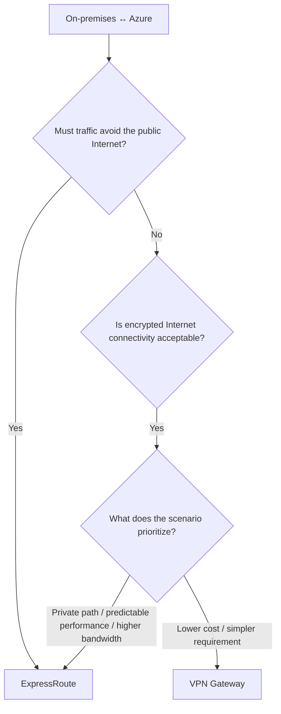

### Choose VPN Gateway When

The scenario allows:

- encrypted connectivity over the public Internet
- lower-cost connectivity
- simpler connectivity requirements

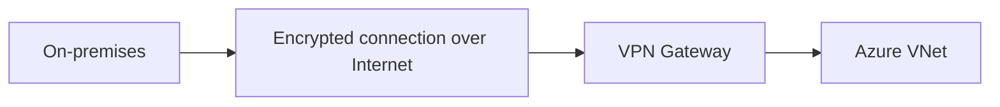

Think:

> **Encrypted Internet connectivity is sufficient → VPN Gateway**

---

### Choose ExpressRoute When

The scenario requires or prioritizes:

- private connectivity
- traffic that does not traverse the public Internet
- more predictable network performance
- higher bandwidth
- enterprise connectivity requirements

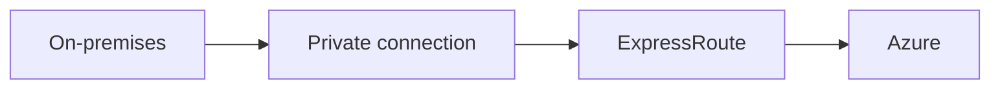

Think:

> **Private connectivity is required → ExpressRoute**

---

### Important Exam Rule

> Do not automatically choose the most powerful solution.

If multiple services can technically satisfy the connectivity requirement, identify what the scenario is optimizing:

```text
Cost
Administrative effort
Security
Performance
Latency
Bandwidth
Public vs private connectivity
```

Then choose the solution that satisfies **all requirements without unnecessary capabilities**.

---

## 5. Azure DNS

Azure DNS provides DNS hosting and name resolution by using Azure infrastructure.

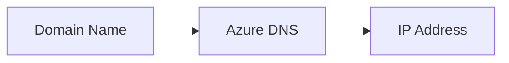

Think:

> **Name resolution → Azure DNS**

Do not confuse DNS with network connectivity.

Azure DNS resolves names.

It does not:

- connect VNets
- create VPN tunnels
- provide RDP/SSH access
- filter network traffic

---

## 6. Public vs Private Endpoint

The important question is:

> **How should the Azure service be accessed?**

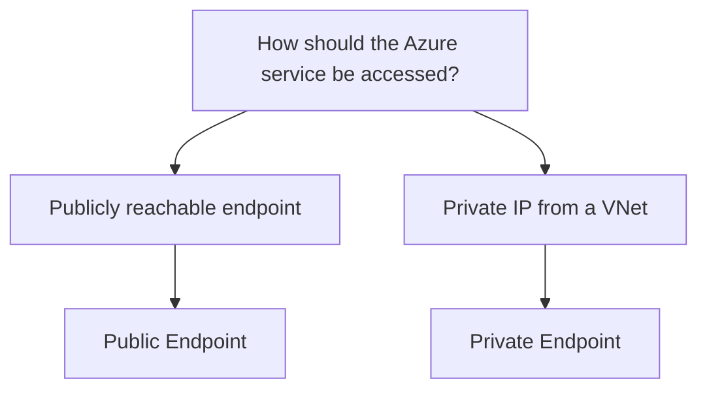

### Public Endpoint

A public endpoint provides access through a publicly reachable endpoint.

Think:

> **Public accessibility → Public Endpoint**

### Private Endpoint

A Private Endpoint provides private access to a supported Azure service by using a private IP address from a VNet.

Think:

> **Private IP access to Azure service → Private Endpoint**

---

## 7. Networking Decision Map

Use this map when you need to identify the networking component quickly.

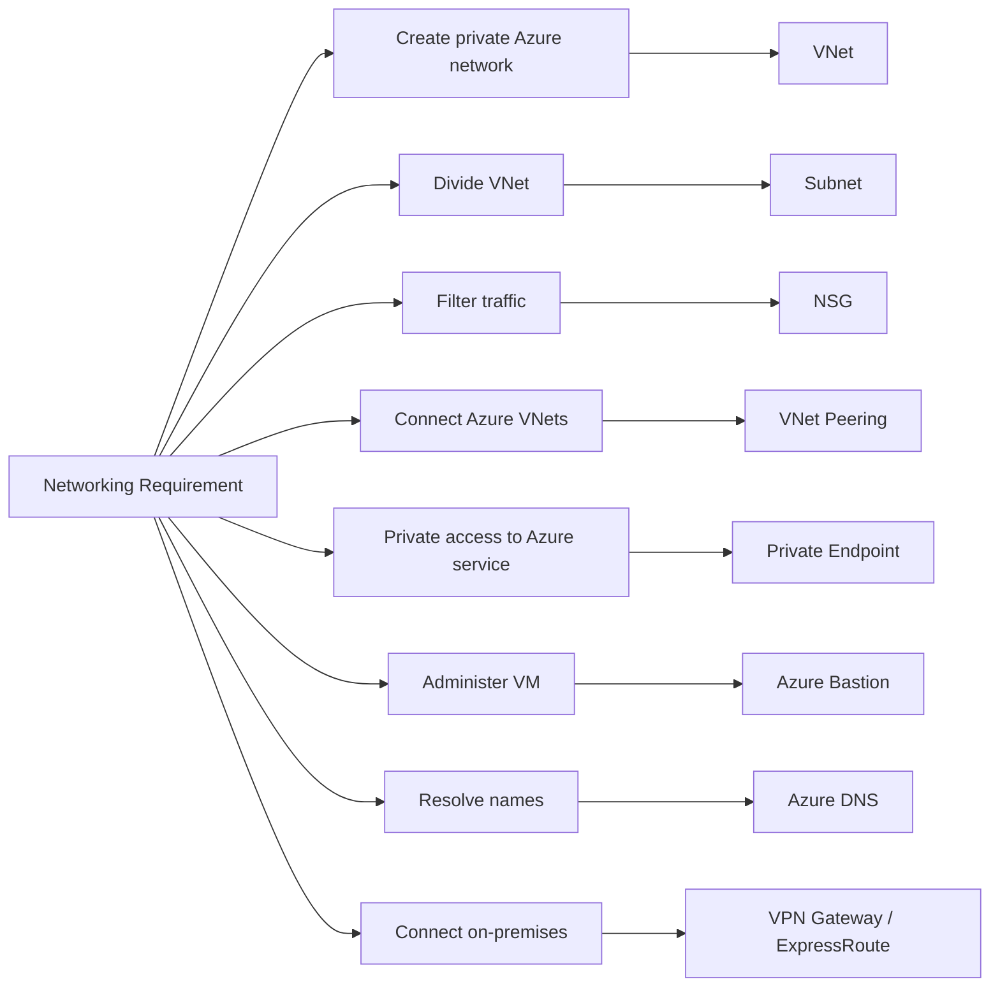

For on-premises connectivity, continue the decision:

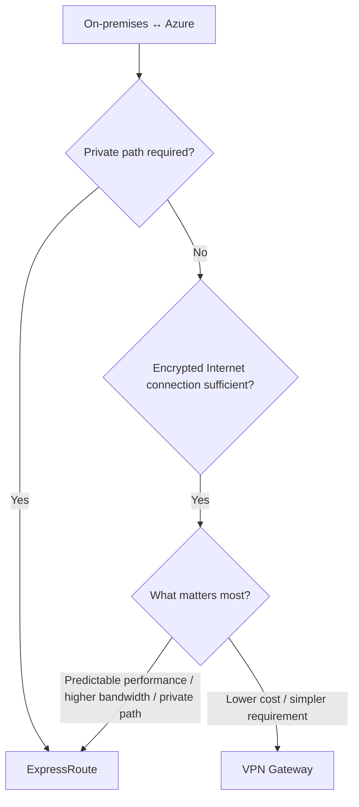

---

## 8. How to Solve Networking Scenario Questions

Do **not** start by searching for a trigger word.

Use the following process instead.

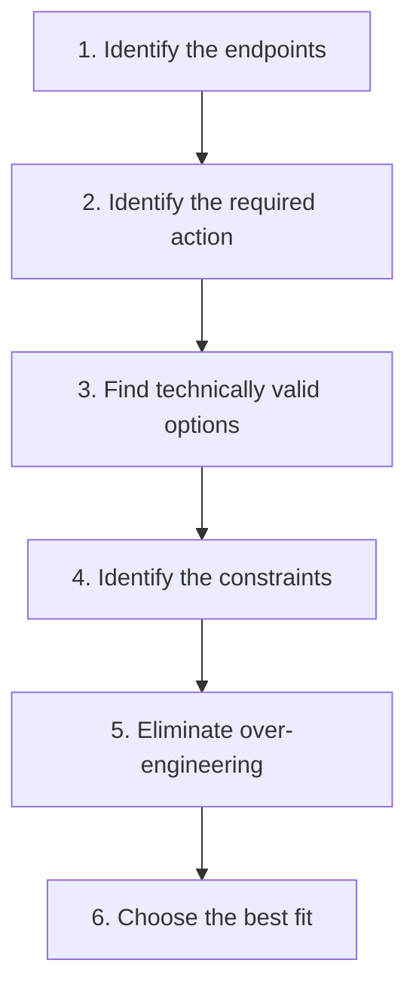

### Step 1 — Identify the Endpoints

Ask:

> **What is communicating with what?**

Examples:

```text
VNet ↔ VNet

VNet ↔ Storage Account

Administrator ↔ VM

On-premises ↔ Azure
```

This immediately eliminates many incorrect answers.

---

### Step 2 — Identify the Action

Ask:

> **What must happen?**

Possible actions include:

```text
CONNECT
FILTER
SEGMENT
RESOLVE
ADMINISTER
PRIVATE ACCESS
```

Examples:

```text
Divide VNet
→ Subnet

Filter traffic
→ NSG

Resolve names
→ Azure DNS

Administer VM
→ Azure Bastion
```

---

### Step 3 — Find Technically Valid Options

Do not immediately select the first familiar service.

Ask:

> **Could more than one answer technically satisfy the basic requirement?**

This is especially important for:

```text
VPN Gateway
vs
ExpressRoute
```

Both may provide connectivity between on-premises and Azure.

The rest of the scenario determines the **best fit**.

---

### Step 4 — Identify the Constraints

Look for requirements involving:

- cost
- administrative effort
- security
- performance
- latency
- bandwidth
- public connectivity
- private connectivity

These constraints often determine the correct answer when several options are technically possible.

---

### Step 5 — Eliminate Over-Engineering

Ask:

> **Does one solution provide capabilities that the scenario never requested?**

Do not automatically choose the most advanced service.

For example:

```text
Encrypted Internet connectivity is acceptable
+
lower cost is important
        ↓
VPN Gateway
```

Choosing ExpressRoute simply because it provides stronger connectivity characteristics may add capabilities that the scenario does not require.

---

### Step 6 — Choose the Best Fit

Choose the simplest solution that satisfies **all stated requirements**.

```text
Technical requirement
        +
Business constraints
        +
No unnecessary capabilities
        ↓
BEST FIT
```

---

## 9. Common Networking Traps

### Trap 1 — "Private" Does Not Automatically Mean Private Endpoint

The word:

```text
Private
```

does not automatically mean:

```text
Private Endpoint
```

First determine **what is being connected**.

---

### Trap 2 — VNet ↔ VNet

```text
VNet A
   ↕
VNet B
```

→ **VNet Peering**

Not Private Endpoint.

---

### Trap 3 — VNet ↔ Azure Service

```text
VNet
   ↕
Azure Storage / Azure Service
```

→ **Private Endpoint**

Not VNet Peering.

---

### Trap 4 — RDP / SSH → VM

```text
Administrator
      ↓
RDP / SSH
      ↓
VM
```

→ **Azure Bastion**

Not Private Endpoint.

---

### Trap 5 — Allow / Deny Traffic

```text
Allow traffic
Deny traffic
Inbound rules
Outbound rules
```

→ **Network Security Group**

Remember:

> NSG controls traffic.  
> NSG does not create connectivity.

---

### Trap 6 — On-Premises ↔ Azure Does Not Automatically Mean ExpressRoute

Both:

```text
VPN Gateway
```

and:

```text
ExpressRoute
```

can appear in on-premises-to-Azure connectivity scenarios.

Do not stop at:

```text
On-premises ↔ Azure
```

Continue with:

```text
Does traffic need to avoid the public Internet?

What does the scenario prioritize?

Cost?
Administrative effort?
Performance?
Bandwidth?
Security?
```

---

### Trap 7 — Subnet vs NSG

```text
Divide the network
→ Subnet

Control traffic
→ NSG
```

A subnet provides segmentation.

An NSG provides traffic filtering.

---

### Trap 8 — Azure DNS Does Not Create Connectivity

```text
Name → IP
→ Azure DNS
```

Azure DNS provides name resolution.

It does not connect networks.

---

## 10. 30-Second Review

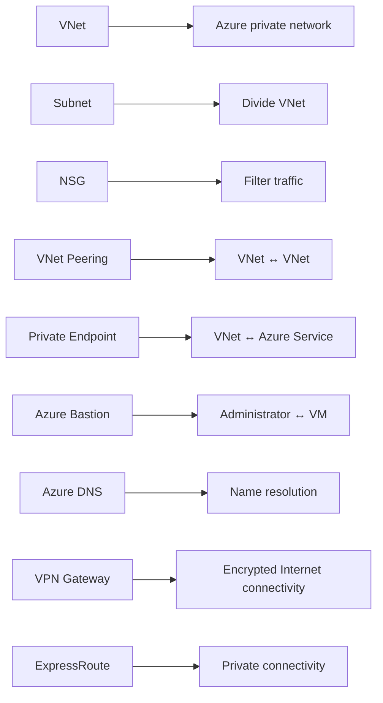

### Final Networking Rule

Before choosing a networking service, ask:

```text
1. WHAT are the endpoints?

2. WHAT must they do?

3. Which solutions CAN technically work?

4. What does the scenario optimize?

5. Which solution satisfies ALL requirements
   without unnecessary capabilities?

→ BEST FIT
```

> **Do not choose by trigger word alone. Choose by endpoint + goal + constraints.**