# Networking — Quick Review

Use this page for a fast review of the most important Azure networking concepts and decision patterns.

The goal is not only to remember what each service does, but to identify the **best-fit solution for a given scenario**.

> **Review principle:** Do not start with a trigger word.  
> First identify **what is communicating with what**, then determine the goal and the business constraints.

## 1. Networking Decision Map

When a networking question looks confusing, start with:

> **What are you trying to connect or accomplish?**

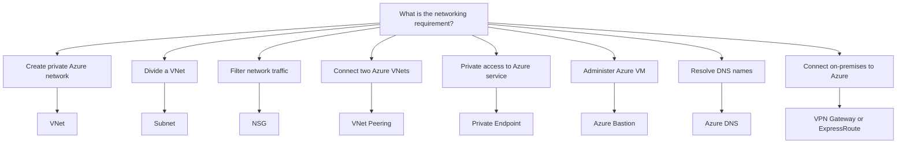

For connectivity questions, identifying the **two endpoints** is especially useful:

```text
VNet ↔ VNet
VNet ↔ Azure Service
Administrator ↔ VM
On-premises ↔ Azure
```

The word **private** alone is not enough to determine the answer.

# 2. Core Networking Components

## Virtual Network — VNet

An Azure Virtual Network provides a private network environment and address space for Azure resources.

Think:

> **Create an Azure private network → VNet**

## Subnet

A subnet divides the address space of a VNet into smaller network segments.

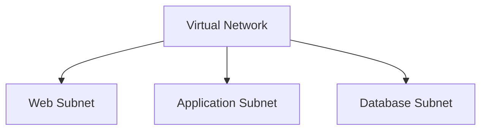

Think:

> **Divide a VNet → Subnet**

A subnet provides **segmentation inside a VNet**. It does not connect separate networks.

## Network Security Group — NSG

A Network Security Group controls inbound and outbound network traffic by using allow and deny rules.

Rules can evaluate characteristics such as:

- source
- destination
- port
- protocol
- traffic direction

Think:

> **Control traffic → NSG**

> **Important:** An NSG controls traffic.  
> It does **not** create network connectivity.

## Public vs Private Endpoint

The important question is:

> **How should the Azure service be accessed?**

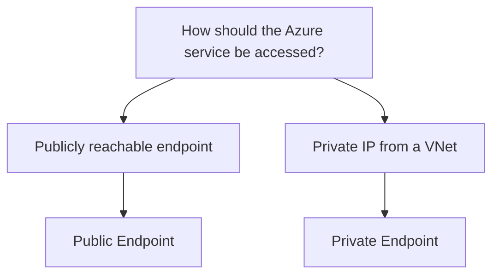

### Public Endpoint

Provides access through a publicly reachable endpoint.

### Private Endpoint

Provides private access to a supported Azure service by using a private IP address from a VNet.

Think:

> **Private IP access to Azure service → Private Endpoint**

# 3. VNet Peering vs Private Endpoint vs Azure Bastion

These services can all appear in private-networking scenarios, but they solve **different problems**.

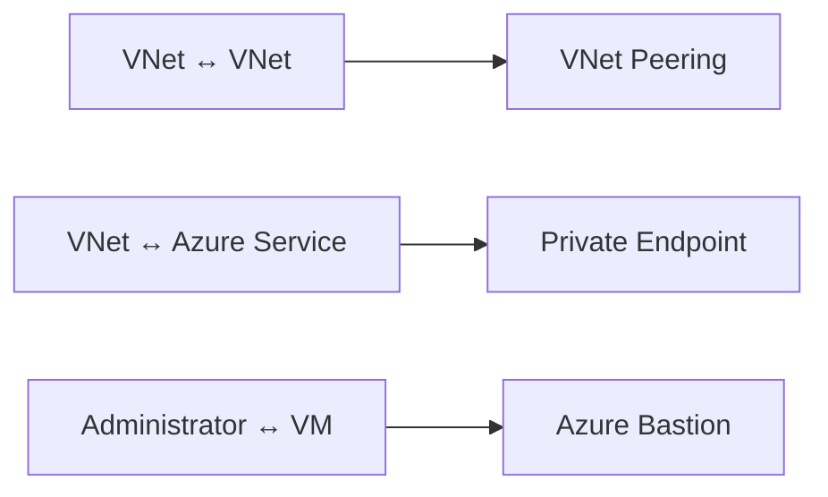

## VNet Peering

Use VNet Peering when **two Azure Virtual Networks** need private connectivity.

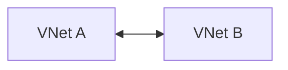

## Private Endpoint

Use a Private Endpoint when a resource in a VNet needs private access to a supported Azure service through a **private IP address**.

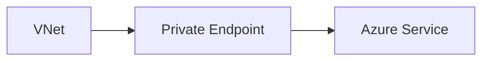

Example:

```text
Application in VNet
        ↓
Private Endpoint
        ↓
Azure Storage
```

## Azure Bastion

Azure Bastion provides secure administrative access to Azure Virtual Machines by using RDP or SSH.

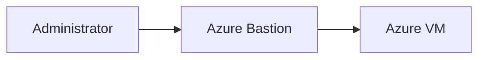

The target VM does not require a public IP address for Bastion access.

### Key Distinction

Do not ask:

> Does the scenario say **private**?

Ask:

> **Private connection between WHAT?**

That determines whether you need Peering, Private Endpoint, or Bastion.

# 4. VPN Gateway vs ExpressRoute

Both services can provide connectivity between an on-premises environment and Azure.

The correct answer depends on the **technical and business requirements**.

| Decision Factor | VPN Gateway | ExpressRoute |
|---|---|---|
| Connection | Encrypted VPN | Private connection |
| Public Internet | Used as transport | Does not traverse public Internet |
| Typical cost | Lower | Higher |
| Setup | Generally simpler | More involved |
| Performance | Internet-dependent | More predictable |
| Bandwidth | Lower options | Higher options available |

## Decision Process

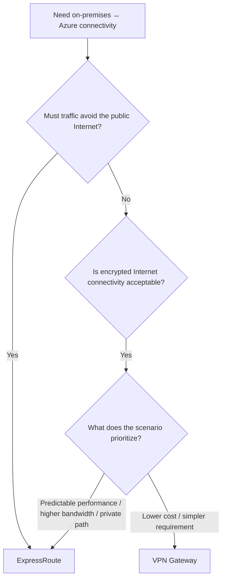

### VPN Gateway

Best fit when:

- encrypted Internet connectivity is acceptable
- lower cost is important
- connectivity requirements are simpler

Think:

> **Encrypted Internet connectivity is sufficient → VPN Gateway**

### ExpressRoute

Best fit when the scenario requires or prioritizes:

- private connectivity
- traffic that does not traverse the public Internet
- more predictable network performance
- higher bandwidth

Think:

> **Private connectivity is required → ExpressRoute**

### Exam Rule

> Do not automatically choose the most powerful solution.

If multiple solutions can technically work, identify what the scenario is optimizing:

```text
Cost
Administrative effort
Security
Performance
Latency
Bandwidth
Public vs private connectivity
```

Choose the solution that satisfies **all requirements without unnecessary capabilities**.

# 5. Azure DNS

Azure DNS provides DNS hosting and name resolution by using Azure infrastructure.

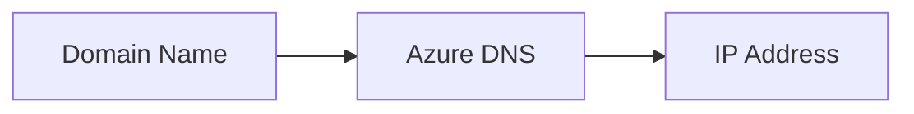

Think:

> **Name resolution → Azure DNS**

Azure DNS resolves names. It does **not**:

- connect VNets
- create VPN tunnels
- provide RDP/SSH access
- filter network traffic

# 6. How to Solve Networking Scenario Questions

Use the following process instead of searching for a trigger word.

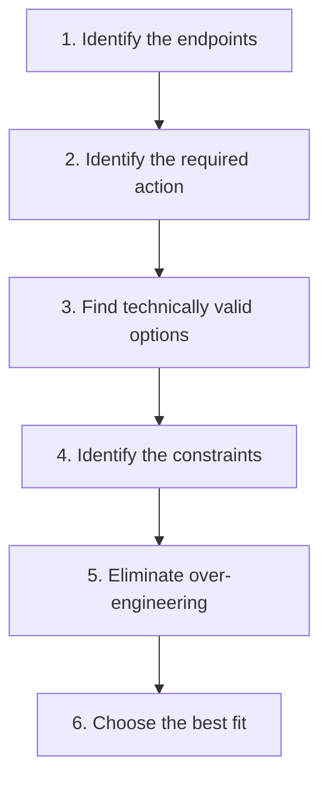

## Step 1 — Identify the Endpoints

Ask:

> **What is communicating with what?**

This determines the scope of the problem.

## Step 2 — Identify the Action

Ask:

> **What must happen?**

Typical actions:

```text
CONNECT
FILTER
SEGMENT
RESOLVE
ADMINISTER
PRIVATE ACCESS
```

## Step 3 — Find Technically Valid Options

Do not immediately select the first familiar service.

Ask:

> **Could more than one answer technically satisfy the basic requirement?**

For example, both VPN Gateway and ExpressRoute can provide on-premises-to-Azure connectivity.

## Step 4 — Identify the Constraints

Look for requirements involving:

- cost
- administrative effort
- security
- performance
- latency
- bandwidth
- public connectivity
- private connectivity

These constraints often determine the correct answer.

## Step 5 — Eliminate Over-Engineering

Ask:

> **Does one solution provide capabilities the scenario never requested?**

Do not automatically choose the most advanced service.

For example:

```text
Encrypted Internet connectivity is acceptable
+
lower cost is important
        ↓
VPN Gateway
```

ExpressRoute provides additional connectivity characteristics, but the scenario may not require them.

## Step 6 — Choose the Best Fit

```text
Technical requirement
        +
Business constraints
        +
No unnecessary capabilities
        ↓
BEST FIT
```

Choose the simplest solution that satisfies **all stated requirements**.

# 7. Common Networking Traps

## Trap 1 — "Private" Is Not a Service Name

Do not automatically choose **Private Endpoint** when you see the word `private`.

Identify the endpoints first.

## Trap 2 — VNet Peering vs Private Endpoint

```text
VNet ↔ VNet
→ VNet Peering

VNet ↔ Azure Service
→ Private Endpoint
```

## Trap 3 — Private Endpoint vs Bastion

```text
Private access to Azure Service
→ Private Endpoint

Secure RDP / SSH to VM
→ Azure Bastion
```

## Trap 4 — Subnet vs NSG

```text
Divide the network
→ Subnet

Control traffic
→ NSG
```

A subnet provides segmentation.

An NSG provides traffic filtering.

## Trap 5 — NSG Does Not Create Connectivity

```text
Allow / Deny
Inbound / Outbound
Port / Protocol
→ NSG
```

NSG controls traffic that already has a network path.

## Trap 6 — On-Premises ↔ Azure Does Not Automatically Mean ExpressRoute

Both VPN Gateway and ExpressRoute may satisfy the basic connectivity requirement.

Continue asking:

```text
Must traffic avoid the public Internet?

Is encrypted Internet connectivity sufficient?

What does the scenario prioritize?

Cost?
Administrative effort?
Performance?
Bandwidth?
```

## Trap 7 — Azure DNS Does Not Create Connectivity

```text
Name → IP
→ Azure DNS
```

DNS provides name resolution, not network connectivity.

# 30-Second Review

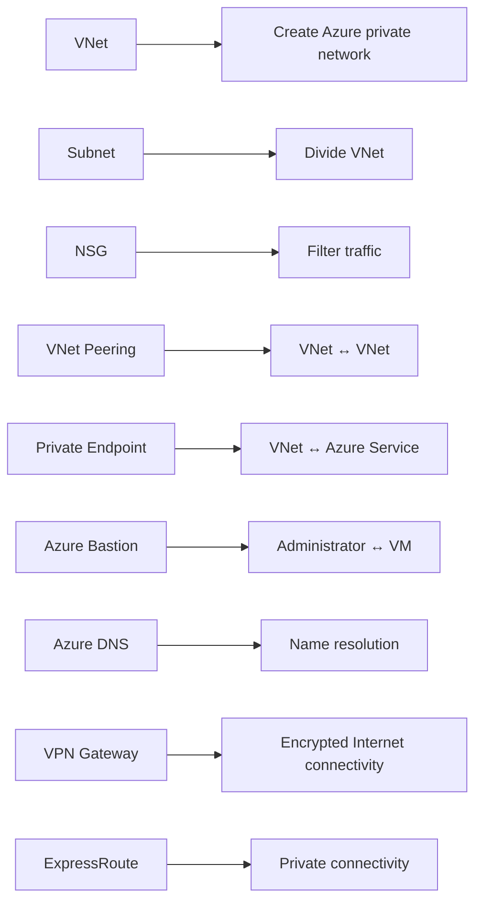

## Final Networking Rule

Before choosing a networking service:

```text
1. Identify the ENDPOINTS.

2. Identify the GOAL.

3. Find the technically VALID OPTIONS.

4. Identify the CONSTRAINTS.

5. Eliminate unnecessary capabilities.

6. Choose the BEST FIT.
```

> **Endpoint + Goal + Constraints → Best Fit**